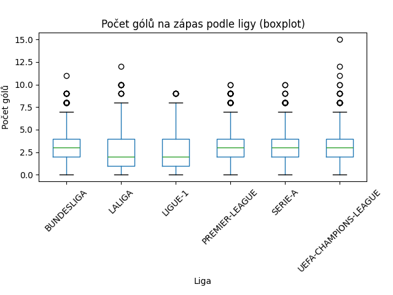

# Je italská nejvyšší liga Serie A skutečně defenzivnější než ostatní?

## Data

Použitá data lze nalézt [zde](https://www.kaggle.com/datasets/davidcariboo/player-scores?select=players.csv). Jedná se o několik souborů ve formátu CSV.

### Zpracování dat

Ze souboru `games.csv` vybereme pouze nejprestižnější ligy. Dále vybereme pouze relevantní sloupce a přidáme sloupec pro celkový počet gólů.

```python3
import pandas as pd

# Načti zápasy a soutěže
matches = pd.read_csv(games_csv)
competitions = pd.read_csv(competitions_csv)

# Normalizuj kódy soutěží na velká písmena
competitions["competition_code"] = competitions["competition_code"].str.upper()

# Vyber prestižní ligy
target = {
    "PREMIER-LEAGUE", "BUNDESLIGA", "LALIGA",
    "SERIE-A", "LIGUE-1", "UEFA-CHAMPIONS-LEAGUE"
}
competitions = competitions[competitions["competition_code"].isin(target)]

# Slouč zápasy se soutěžemi podle competition_id
df = matches.merge(competitions, on="competition_id")

# Vyber potřebné sloupce
df = df[
    ["date", "season", "competition_code",
     "home_club_name", "away_club_name",
     "home_club_goals", "away_club_goals"]
]

# Spočítej celkový počet gólů
df["total_goals"] = df["home_club_goals"] + df["away_club_goals"]

# Ulož výsledek
df.to_csv(output_csv, index=False)
print(f"Uloženo: {len(df)} zápasů → {output_csv}")
````

## Analýza

Cílem je ověřit, zda je Serie A ve sledovaném období skutečně defenzivnější než ostatní top ligy. To provedeme testem průměrného počtu gólů na zápas.

### Hypotéza

* $H_0$: Průměrný počet gólů na zápas v Serie A není nižší jak průměrný počet gólů v ostatních ligách.
* $H_1$: Průměrný počet gólů na zápas v Serie A je nižší než v ostatních ligách.

### Postup

Nejprve vizualizujeme data:

```python3
import pandas as pd
import matplotlib.pyplot as plt

# Načti filtrovaná data
matches = pd.read_csv(processedMatches_csv)

# Boxplot pro všechny ligy
matches.boxplot(column="total_goals", by="competition_code", grid=False, figsize=(10, 6))
plt.title("Počet gólů na zápas podle ligy")
plt.suptitle("")
plt.xlabel("Liga")
plt.ylabel("Počet gólů")
plt.xticks(rotation=45)
plt.tight_layout()
plt.show()

# Histogram Serie A vs ostatní ligy
serie_a = matches[matches["competition_code"] == "SERIE-A"]["total_goals"]
ostatni = matches[matches["competition_code"] != "SERIE-A"]["total_goals"]

plt.figure(figsize=(8, 5))
plt.hist(serie_a, bins=range(int(matches["total_goals"].max()) + 2), alpha=0.5, label="Serie A")
plt.hist(ostatni, bins=range(int(matches["total_goals"].max()) + 2), alpha=0.5, label="Ostatní ligy")
plt.title("Histogram počtu gólů na zápas")
plt.xlabel("Počet gólů")
plt.ylabel("Počet zápasů")
plt.legend()
plt.tight_layout()
plt.show()
```



Boxplot již naznačuje, že rozdíl nebude nijak veliký.

#### Test

Provedeme jednostranný t-test průměrů:

```python3
import pandas as pd
from scipy.stats import ttest_ind

# Načti filtrovaná data
df = pd.read_csv(processedMatches_csv)

# Odděl Serie A a ostatní ligy
serie_a = df.loc[df["competition_code"] == "SERIE-A", "total_goals"].dropna().astype(float)
ostatni = df.loc[df["competition_code"] != "SERIE-A", "total_goals"].dropna().astype(float)

# Popisná statistika
n1, n2 = len(serie_a), len(ostatni)
m1, m2 = serie_a.mean(), ostatni.mean()
sd1, sd2 = serie_a.std(ddof=1), ostatni.std(ddof=1)

print(f"⚽️ Serie A: n={n1}, mean={m1:.3f}, sd={sd1:.3f}")
print(f"📊 Ostatní:  n={n2}, mean={m2:.3f}, sd={sd2:.3f}")

# Jednostranný t-test
t_stat, p_value = ttest_ind(serie_a, ostatni, alternative="less", equal_var=False)

print("\n🔬 Jednostranný t-test:", end=" ")
print(f"(t = {t_stat:.4f}, p = {p_value:.6f})")

if p_value < 0.05:
	print("✅ p < 0.05 → Zamítáme H0: Serie A má statisticky nižší průměr gólů.")
else:
	print("❌ p ≥ 0.05 → Nemůžeme zamítnout H₀ – nelze tvrdit, že Serie A má méně gólů.")
```

#### Závěr

Výstup:

```
⚽️ Serie A: n=4870, mean=2.747, sd=1.655
📊 Ostatní: n=19963, mean=2.794, sd=1.698

🔬 Jednostranný t-test: (t = -1.7810, p = 0.037472i)
✅ p < 0.05 → zamítáme H0: Serie A má statisticky nižší průměr gólů.
```

Ačkoli test vyšel jako statisticky významný, rozdíl je velmi malý a z praktického hlediska zanedbatelný.
